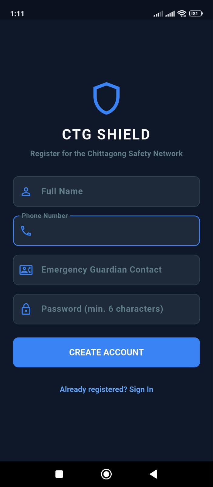

# 🛡️ CTG Shield — Mobile Safety Radar

An intelligent civic safety and real-time emergency proximity alert platform built for the Chittagong metropolitan area.

---

## 📥 Download App

[-3B82F6?style=for-the-badge&logo=android&logoColor=white)](https://github.com/irtazirfan08-source/CTG_Shield_Mobile/releases/download/v1.0.1/app-release.apk)

---

## 📱 Application Interface

| 1. Sign In | 2. Register | 3. Live Radar Map | 4. Report Incident | 5. SOS Siren Broadcast |
| :---: | :---: | :---: | :---: | :---: |
|  |  |  |  |  |

---

## ✨ Key Features

* **JWT Session Persistence:** Secure user registration, authentication, and encrypted token storage via `flutter_secure_storage`.
* **Interactive Safety Radar:** Real-time OpenStreetMap rendering showing danger clusters across GEC, 2 No Gate, Agrabad, and Chawkbazar.
* **Live GPS Tracking:** Dynamic threat level scoring evaluated against active incident hotspots.
* **Proximity SOS Dispatch:** Emergency broadcast modal displaying victim profile and guardian contact with an audio alarm siren.
* **Community Incident Reporting:** Geotagged pin submission for active street incidents.

---

## 🚀 Setup & Run Locally

```bash
git clone [https://github.com/irtazirfan08-source/CTG_Shield_Mobile.git](https://github.com/irtazirfan08-source/CTG_Shield_Mobile.git)
cd CTG_Shield_Mobile
flutter pub get
flutter run